# Generative Latent Optimization in Tensorflow

As part of the implementation series of [Joseph Lim's group at USC](http://csail.mit.edu/~lim), our motivation is to accelerate (or sometimes delay) research in the AI community by promoting open-source projects. To this end, we implement state-of-the-art research papers, and publicly share them with concise reports. Please visit our [group github site](https://github.com/gitlimlab) for other projects.

This project is implemented by [Shao-Hua Sun](http://shaohua0116.github.io) and the codes have been reviewed by <!--- --> before being published.

## Descriptions
This project is a [Tensorflow](https://www.tensorflow.org/) implementation of **Generative Latent Optimization (GLO)** proposed in the paper [Optimizing the Latent Space of Generative Networks](https://arxiv.org/abs/1707.05776). GLO is an exciting new generative model framework which enjoys many of the desirable properties of GANs including modeling data distributions, generating realistic samples, interpretable latent space, but more importantly, it doesn't suffer from unstable adversarial training dynamics.

GLO learns to map learnable latent vectors to samples in a target dataset by minimizing a reconstruction loss. During the traning phase, optimizaing the parameters of the generator and tuning the corresponding latent vectors are alternatively performed. When convergedthe model is able to generate novel samples given latent vectors sampled from the distribution. The illustratino of the GLO framework is as follows.

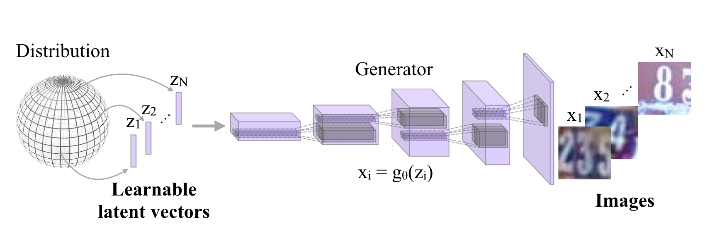

The implemented model is trained and tested on three publicly available datasets: [MNIST](http://yann.lecun.com/exdb/mnist/), [SVHN](http://ufldl.stanford.edu/housenumbers/), and [CIFAR-10](https://www.cs.toronto.edu/~kriz/cifar.html). Model's ability to recontruct samples, generate new samples, and interploate in a latent space are tested in this implementation.

Note that this implementation only follows the main idea of the original paper while differing a lot in implementation details such as model architectures, hyperparameters, applied optimizer, etc. Particularly, the updating procedure applied to latent vectors is mainly implemented based on my conjectures.

\*This code is still being developed and subject to change.

## Prerequisites

- Python 2.7 or Python 3.3+
- [Tensorflow 1.2.0](https://github.com/tensorflow/tensorflow/tree/r1.2)
- [SciPy](http://www.scipy.org/install.html)
- [NumPy](http://www.numpy.org/)
- [Scikit-learn](http://scikit-learn.org/stable/)
- [PIL](http://pillow.readthedocs.io/en/3.1.x/installation.html)
- [h5py](http://docs.h5py.org/en/latest/)
- [progressbar](http://progressbar-2.readthedocs.io/en/latest/index.html)
- [colorlog](https://github.com/borntyping/python-colorlog)

## Usage

### Datasets
Download datasets with specified settings. For examples:
```bash
$ python download.py --dataset MNIST --distribution PCA --dimension 10
$ python download.py --dataset SVHN --distribution Uniform --dimension 25
$ python download.py --dataset CIFAR --distribution Gaussian --dimension 35
```
Note that `distribution` indicates the initial distribution of the latent space and `dimension` specifies the dimension of each latent vector.

### Train the models
Train models with downloaded datasets. For example:
```bash
$ python trainer.py --dataset MNIST --alpha 5 --dump_result --batch_size 32
$ python trainer.py --dataset SVHN --alpha 10 --lr_weight_decay
$ python trainer.py --dataset CIFAR10 --alpha 10 --learning_rate 1e-5
```
Note that `alpha` indicates the weight of updating latent vectors at each iteration.

### Test the models
Test models with saved checkpoints:
```bash
$ python evaler.py --dataset MNIST --checkpoint ckpt_dir --prefix mnist --reconstruct --generate
$ python evaler.py --dataset SVHN --checkpoint ckpt_dir --prefix svhn  --interpolate
$ python evaler.py --dataset CIFAR10 --checkpoint ckpt_dir --prefix cifar 
```
There are three task options: reconstruction (--reconstruct), sample generation (--generate), and sample interpolation (--interpolate).

The *ckpt_dir* should be like: ```train_dir/default-MNIST_lr_0.0001-20170101-123456/model-1001```

### Train and test your own datasets:

* Create a directory
```bash
$ mkdir datasets/YOUR_DATASET
```

* Store your data as an h5py file datasets/YOUR_DATASET/data.hy and each data point contains
    * 'image': has shape [h, w, c], where c is the number of channels (grayscale images: 1, color images: 3)
    * 'code': represented as an vector sampled a distributionn
* Maintain a list datasets/YOUR_DATASET/id.txt listing ids of all data points
* Modify trainer.py.
* Finally, test your trained models:
```bash
$ python evaler.py --dataset YOUR_DATASET
```
## Results

### SVHN

* Reconstructed samples


* Generated samples

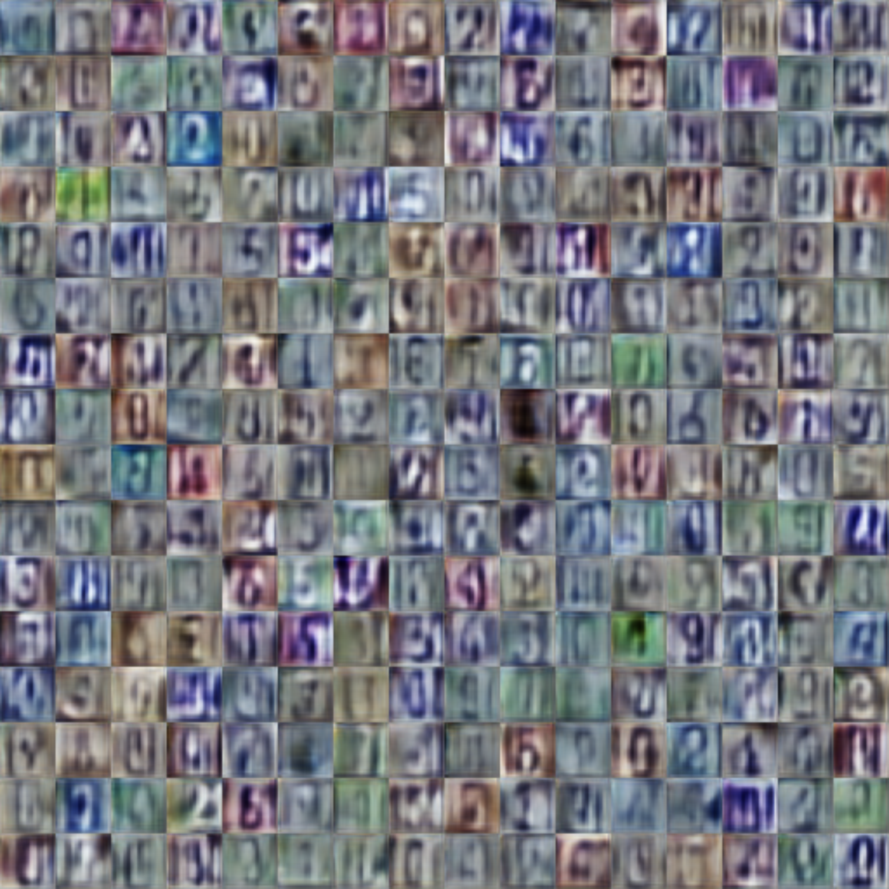

* Sample interpolation

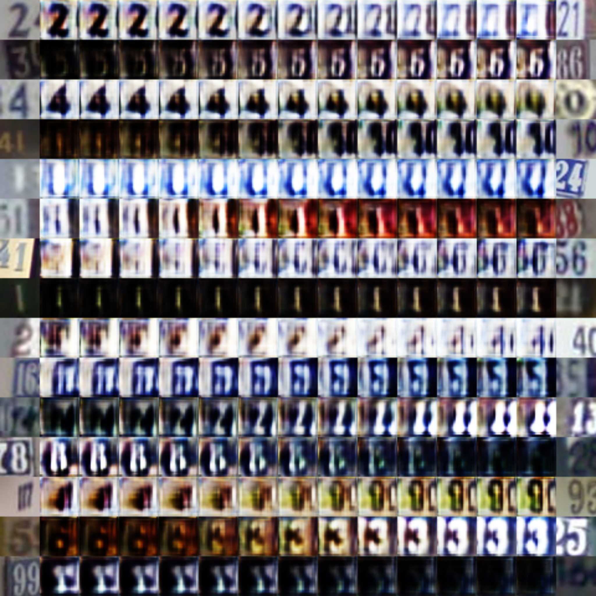

* Reconstructed process (first 73 epochs)

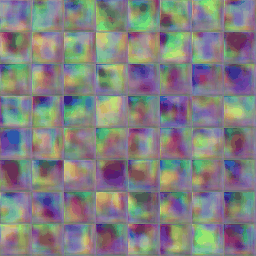

### MNIST

* Reconstructed samples

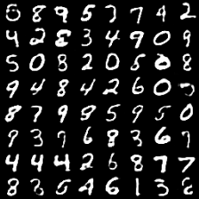

* Generated samples

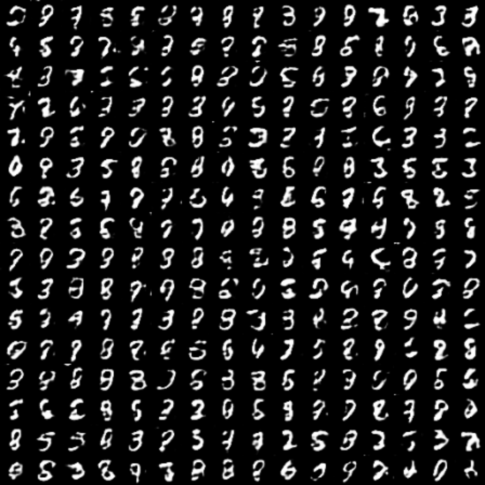

* Sample interpolation

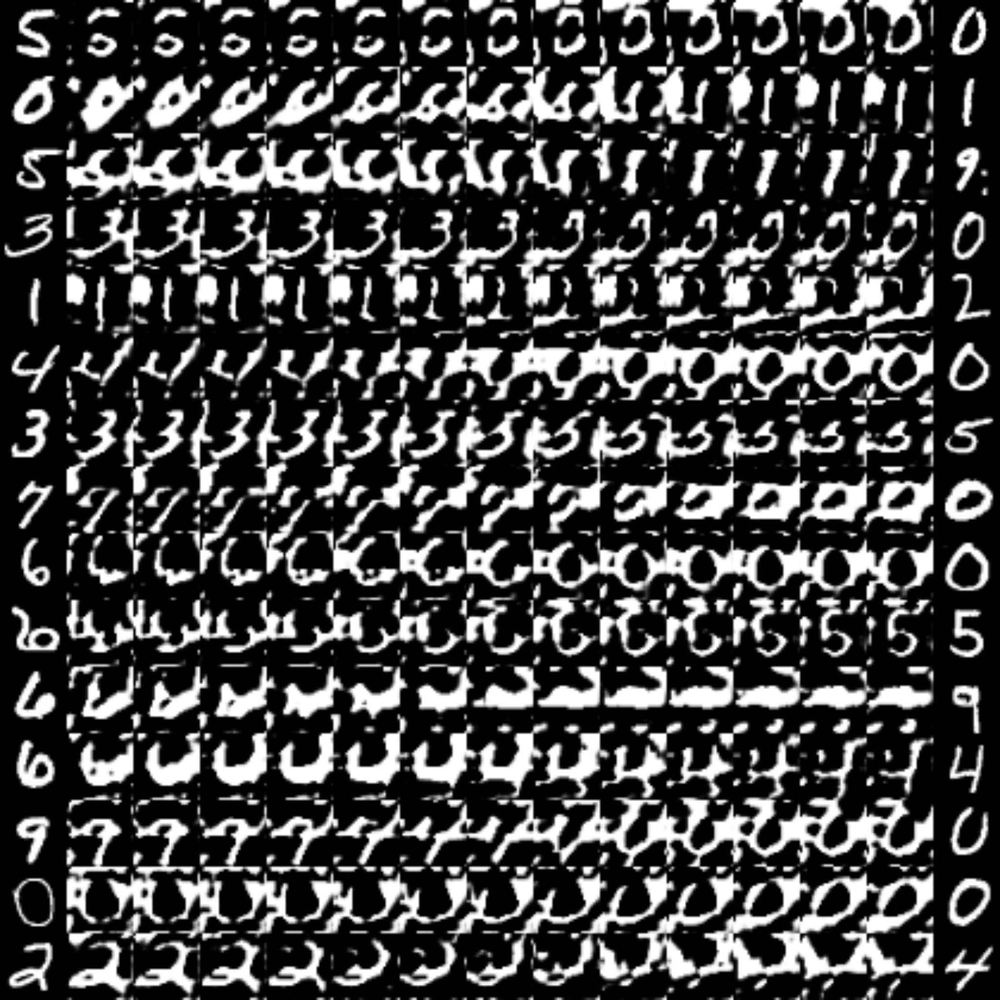

* Reconstructed process (first 192 epochs)

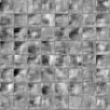

### CIFAR-10

* Reconstructed samples

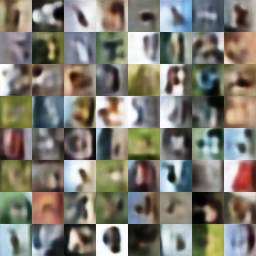

* Generated samples

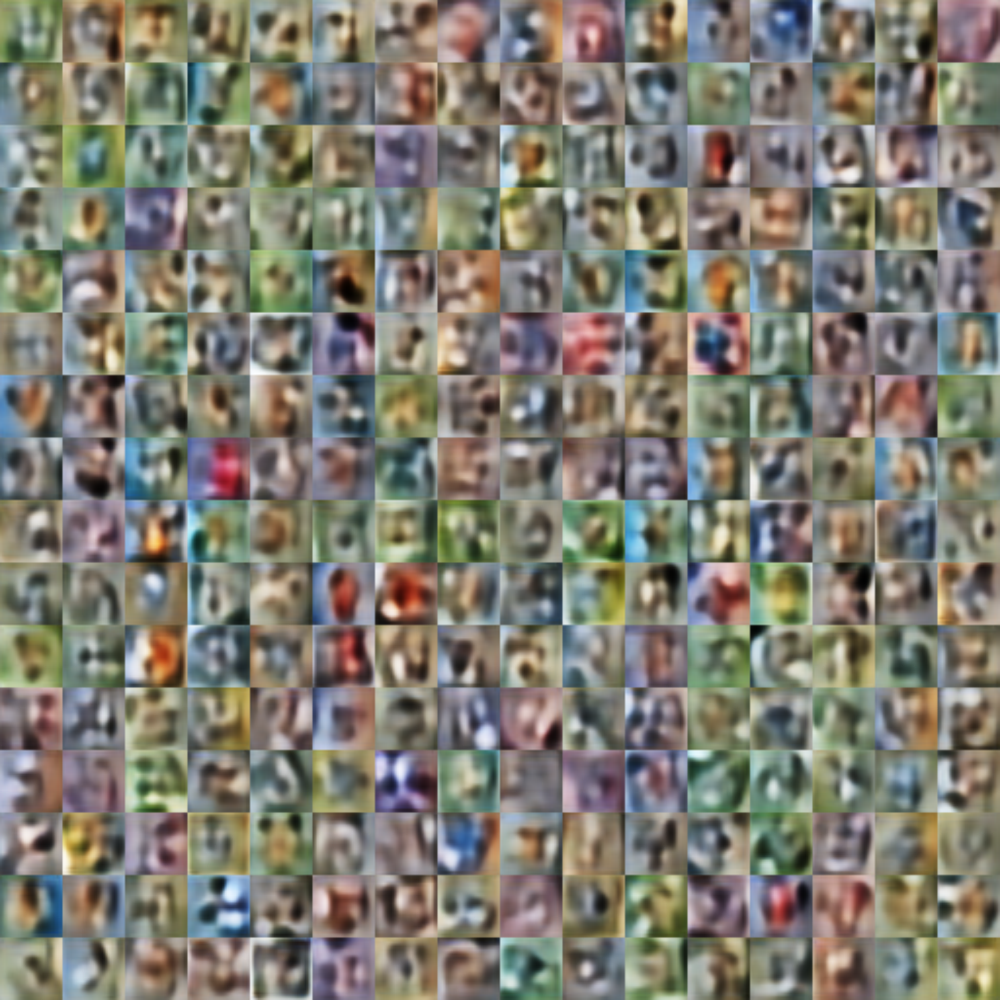

* Sample interpolation

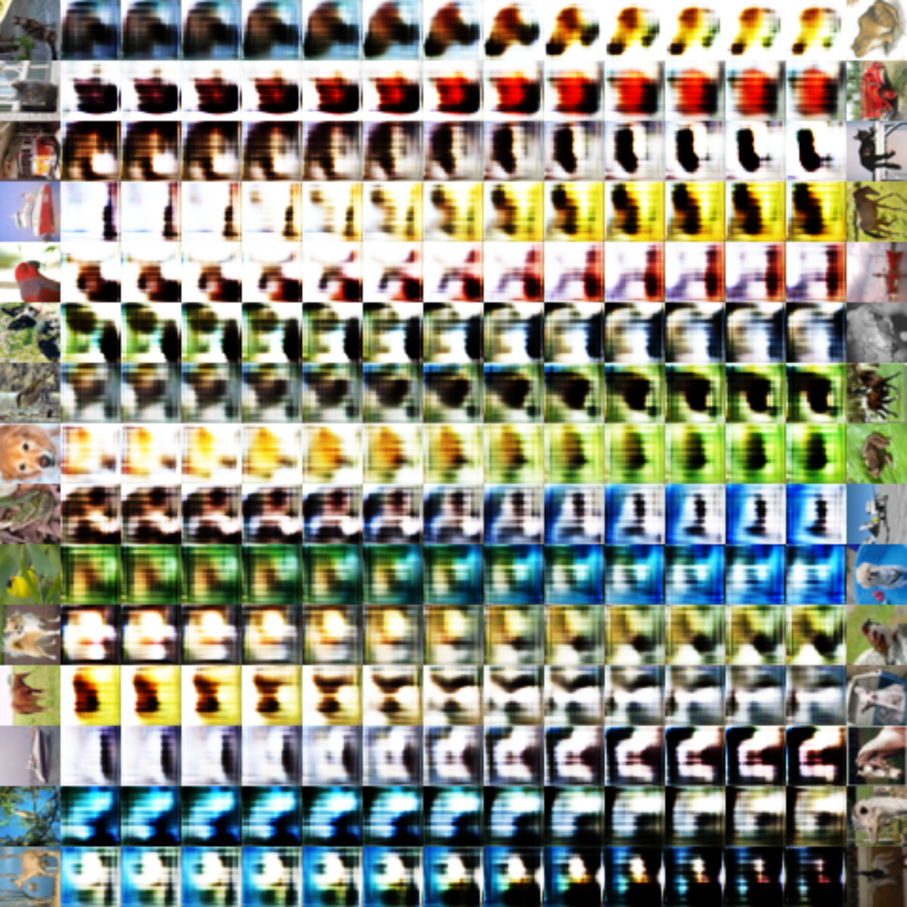

* Reconstructed process (first 192 epochs)


## Training details

### SVHN

* The reconstruction loss


### MNIST

* The reconstruction loss

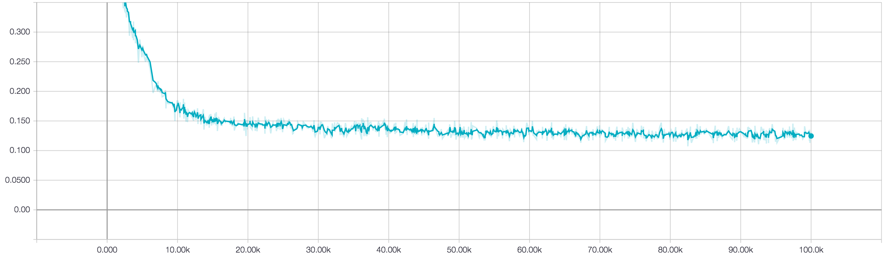

### CIFAR-10

* The reconstruction loss

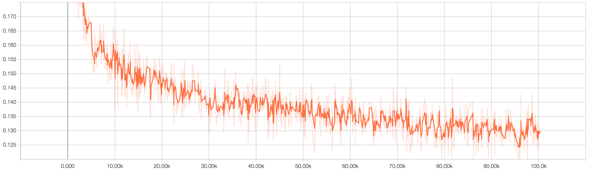

## Related works

* [Generative Adversarial Networks](https://arxiv.org/abs/1406.2661) by Goodfellow et. al
* [Unsupervised Learning by Predicting Noise](https://arxiv.org/abs/1704.05310) by Bojanowski and Joulin
* [Compressed Sensing using Generative Models](https://arxiv.org/abs/1703.03208) by Bora et. al.
* My implementation of [Semi-supervised learning GAN](https://github.com/gitlimlab/SSGAN-Tensorflow)
* The architecture diagram is modified from the one drawn in [Unsupervised Representation Learning with Deep Convolutional Generative Adversarial Networks](https://arxiv.org/abs/1511.06434)

## Author

Shao-Hua Sun / [@shaohua0116](https://github.com/shaohua0116/) @ [Joseph Lim's research lab](https://github.com/gitlimlab) @ USC
